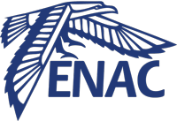
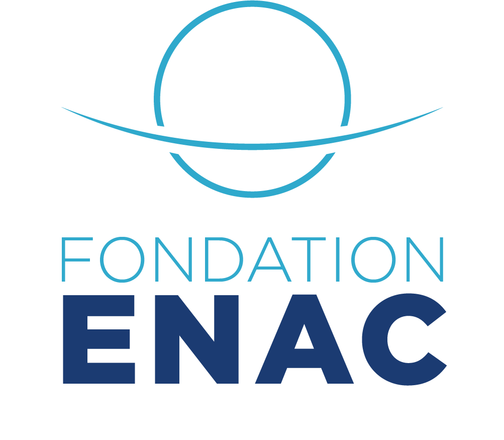

---
# A Demo section created with the Blank widget.
# Any elements can be added in the body: https://wowchemy.com/docs/writing-markdown-latex/
# Add more sections by duplicating this file and customizing to your requirements.

widget: featurette #pages #hero # See https://wowchemy.com/docs/page-builder/
headless: true # This file represents a page section.
weight: 80 # Order that this section will appear.
title: ENAC and The ENAC Foundation
hero_media: welcome.jpg
design:
  # Choose how many columns the section has. Valid values: 1 or 2.
  columns: '1'
  # Add custom styles
#   css_style:
#   css_class:

---
<p align="center" width="100%">
    
</p>

---


# ENAC



ENAC, École Nationale de l'Aviation Civile, is Europe's largest aeronautical Grandes Écoles or university.
ENAC trains a wide range of professionals: engineers and high-level professionals capable of designing and developing aeronautical systems (aircraft, including cockpits and engines) and, more broadly, air transport systems (airports, airlines, etc.), as well as airline pilots, air traffic controllers and aeronautical technicians.
ENAC is ever closer to the world of business and innovation, thanks to strong partnerships with major players in the aeronautical world. As a result, the school offers its students rich and varied professional experience, in tune with the business world. It also enables them to develop numerous research and innovation partnership projects.
The school's research laboratories are at the cutting edge of innovation, working actively with top-level international universities to ensure that air transport is ever safer, more efficient and more sustainable.
https://www.enac.fr/fr 


---

# The ENAC Foundation



The mission of the ENAC Foundation is to support the development of ENAC through the patronage of companies, institutions and individual donors; to promote its brand image and reputation in order to enhance its national and international influence; to strengthen ENAC's links with the socio-economic world; and, more broadly, to promote ENAC's values and model, both within its community and with its partners and society at large.
The ENAC Foundation is a partnership foundation, co-founded by ENAC, Airbus and the ADP Group. 
"Accelerating ambition in training and research for the benefit of air transport".
By supporting research and innovation at ENAC through the creation of teaching and research Chairs based on the school's multidisciplinary areas of expertise, alongside its corporate sponsors, major players in the aeronautics industry. 
The Chairs help shape tomorrow's solutions in terms of ecological transition, digitalization and ever safer, more intelligent and sustainable mobility systems. This dynamic of open research and innovation not only contributes to the progress of the entire sector, but also to the excellence of ENAC's training courses, by transmitting knowledge on cutting-edge themes to all the school's students.
https://fondation.enac.fr/ 


<!-- <br> -->

<!-- ENAC is internationally recognized as the leading aeronautics and aviation university in Europe, providing a broad range of training, studies and research activities.
École Nationale de l’Aviation Civile (ENAC), the school of the Direction Générale de l’Aviation Civile (Civil Aviation Authority, or DGAC) under the supervision of the French Ministry of Ecological and Solidarity Transition, combines education and research in aeronautical engineering, air navigation and aircraft piloting.

Every year ENAC admits over 2000 students who are enrolled in more than 30 programmes of study, and 3500 trainees enrolled in continuing education programmes.

ENAC’s 24,000 graduates can be found in some 100 different countries on all 5 continents – proof of the school’s international influence. Its scale and its human and pedagogical resources make ENAC the leading European school of aeronautics today.

Since its creation in 1949, ENAC has provided professional training to civil aviation personnel such as Air Traffic Controllers, ATSEPs and technicians for Civil Aviation Authorities (CAA) or Air Navigation Service Providers from all over the world (e.g. China, Switzerland, EuroControl, Indonesia, Philippines, Brazil, Africa, Georgia, Mongolia, Saudi Arabia).

ENAC alumni work in aeronautical and aviation companies, in fields such as manufacturing (Airbus, ATR, Embraer, Safran, P&W, GE, Rockwell Collins, Thales, Indra), and airports, airlines, civil aviation authorities as well as air navigation providers across the globe.

ENAC is also known internationally for its training of ATPL and MPL pilots for airlines including Air France, Easyjet, Transavia, Sichuan Airline, China Eastern, Shanghai Airline, Lao Airline, Oman Air and Royal Air Maroc.

Innovative ENAC research laboratories work in cooperation with the best universities worldwide to provide a safer, more efficient and more sustainable air transport system.

```mermaid 
gantt
	  dateFormat  YYYY-MM-DD
	  section Section
	  A task           :a1, 2014-01-01, 30d
	  Another task     :after a1  , 20d
	  section Another
	  Task in sec      :2014-01-12  , 12d
	  another task     : 24d
``` -->
