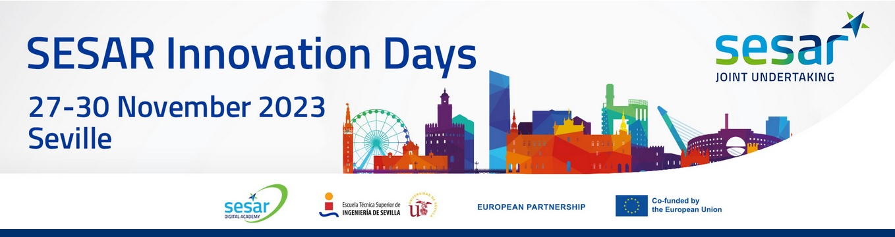

We attended SESAR Innovation Days 2023 and presented a poster.

<!--more-->

The <a href="https://www.sesarju.eu/SIDS2023" target="_blank">SESAR Innovation Days 2023</a> took place in Seville, Spain from 27 till 30 November, hosted by the University of Seville at the Faculty of Engineering.

During all _Exhibition break_ we presented our concept of [U-spaceChain](https://enac-drones.github.io/publication/2023_sid/).

There were technical papers about **High performing airport operations** ; **Speech Recognition** ; **Machine Learning and Artificial Intelligence** ; **ATM operations, architecture, and Performance** ; **Human Factors and Decision Support Tools** ; **Trajectories, safety, and transversal aspects** ; **Environment and Meteorology** ; **Network and Flow management** ; **UAS, U-space, and UAM** ; **Mobility** ; **Airspace Management and Design**.

There were also plenary sessions, about **Higher Airspace Operations** and **AI in ATM**.

---

    

---

<!--<iframe width="560" height="315" src="https://www.youtube.com/embed/0MGmwDh7u-I?si=ntc88idkoh9hKQH4" title="YouTube video player" frameborder="0" allow="accelerometer; autoplay; clipboard-write; encrypted-media; gyroscope; picture-in-picture; web-share" allowfullscreen></iframe>-->
