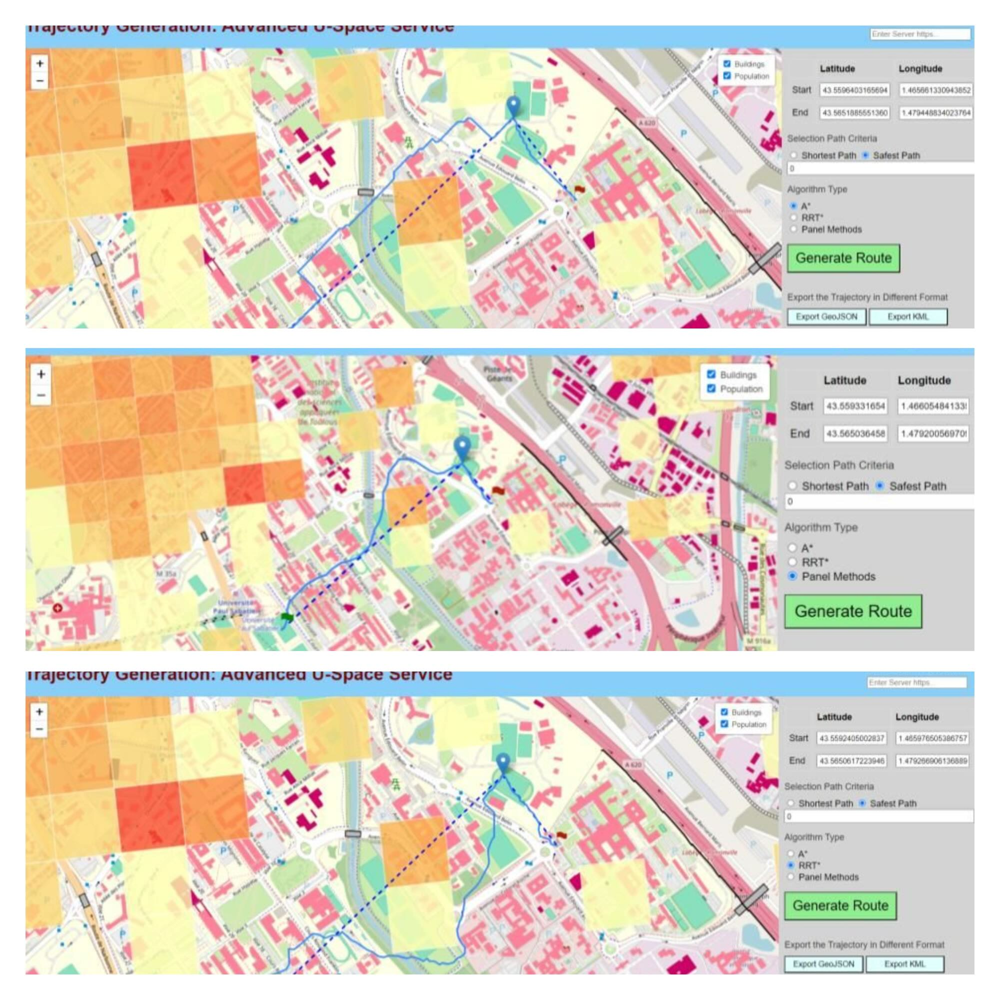

Systems Engineering Students:  [IATSED](https://www.enac.fr/en/master-international-air-transport-system-engineering-and-design-iatsed) _Ankush Kumar_ and _Ramkumar Narayanan_ teamed with [ENAC Engineers](https://www.enac.fr/en/enac-graduate-engineer-0) _Xiangyu Cao_ and _Lucas Le Menn_ for their Capstone project. 

<!--more-->

What a success!
Their objective was to specify and build an advanced U-space service, from scratch and full-stack, for trajectory generation. 

ENAC - Ecole Nationale de l'Aviation Civile - Airbus - Sopra Steria Drones &amp; UTM Research Chair served as the primary client and the project was tutored by Dong Bach Vo. We were involved in requirements definition, Verification and Validation; functional and technical advisory. 

The technological stack was Python (Flask) and JS (Node - Leaflet). Not only did it involve both API creation and connection to Geoportail as well as other data providers, but also programming different path generation algorithms like A*, RRT*, and Panel Method.

Wish them the best in their future career as Systems Engineer and Developer!

---

    

---

<!--<iframe width="560" height="315" src="https://www.youtube.com/embed/0MGmwDh7u-I?si=ntc88idkoh9hKQH4" title="YouTube video player" frameborder="0" allow="accelerometer; autoplay; clipboard-write; encrypted-media; gyroscope; picture-in-picture; web-share" allowfullscreen></iframe>-->
