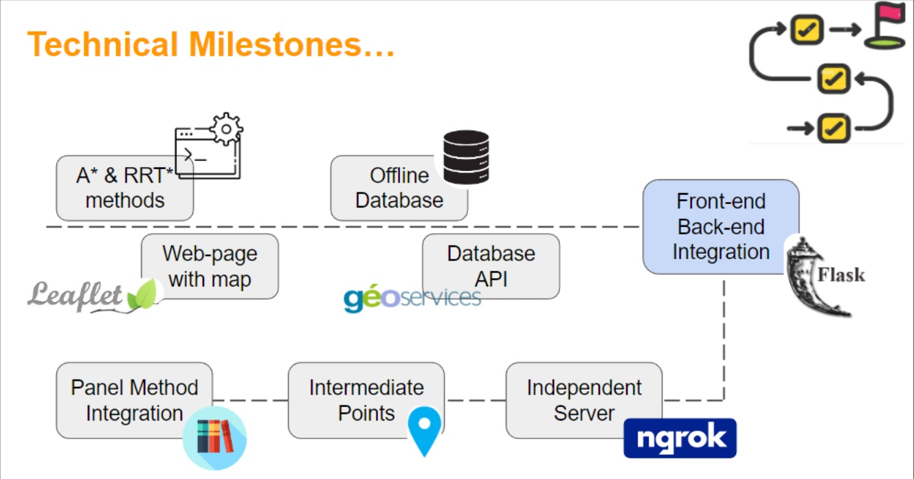

Post-presentation interview with Capstone Project students: 
<!-- Systems Engineering Students:  [IATSED](https://www.enac.fr/en/master-international-air-transport-system-engineering-and-design-iatsed) _Ankush Kumar_ and _Ramkumar Narayanan_ teamed with [ENAC Engineers](https://www.enac.fr/en/enac-graduate-engineer-0) _Xiangyu Cao_ and _Lucas Le Menn_ for their Capstone project.  -->

<!--more-->

The team was made up of IATSED students Ankush Kumar and Ramkumar Narayanan, along with IENAC students Xiangyu CAO and Lucas Le Menn. They were supervised by Dr Dong Bach Vo, from ENAC's Interactive Computing Laboratory. The ENAC - Airbus - Sopra Steria "Drone & UTM" Research and Teaching Chair acted as customer and end-user. Find out more about the english version. 

Safe and efficient operations in U-space will rely on several services provided by U-space (the airspace reserved for drones) Service Providers to Drone Operators and pilots. 
Some services are already identified by regulation or by Sesar projects. 
Trajectory generation is important as it will be the basis of services such as Flight Authorization and both Strategic and Tactical Deconfliction. 
This project aims to develop a trajectory planning application: an advanced service as it is outside of the current U-space regulatory framework's scope. 
 

### Ankush Kumar : How did the project fit in with your studies? 

We have had a multicultural and multidisciplinary team. Multicultural with 2 Indian, 1 French, and 1 Chinese members. Multidisciplinary as 2 were pursuing the IATSED course and 2 were in the IENAC-SITA_ISI course 

This project required us to develop a system that presented us with the opportunity to implement the knowledge from the said courses to design and develop the system. 

For the system conceptualization and design, we elicited the user needs and developed the system architecture, requirements, and detail design using the learnings from our many System Engineering and HMI courses.  

### Ramkumar Narayanan : Did the human relations within the project bring you open-mindedness or new knowledge? 

As you know, the team consists of 4 members, each person has different skills and competencies. Ankush was assigned the role of project manager, while the other three members were part of the development team. 
We divided the entire project into weekly tasks,assigning each task to a member best suited for it based on their competencies.  
Effective communication between team members was crucial. It helped to prevent conflicts and created a learning environment where team members interacted with each other, when technical or documentation help was needed.  
For system Verification, we created tasks to review each other's work and communicated the possible improvements. With strong human relations within our team facilitated this effective communication. 
 

We had regular Interactions with our Mentor(Dong-Bach VO), our Client (Balita RAKOTONARIVO) and other Researchers from ENAC-Airbus-Sopra Steria Research Chair. These Interactions gave us a clear Idea to design, develop and test the system of our project’s system.   
 

### Xiangyu Cao : How has this research experience enriched your skills? 

The project was very technical and we got a complete experience of the software development process.  
By working on this project, we have gained new knowledge in a lot of Subjects. A Slide from our presentation below, speaks about the new technical knowledge gained by team members during this project: 

---

    

---

### Lucas Le Menn : What are your future projects related to this research experience? 

Currently there is no plan for future development from our team as we will focus on our internships for the following 6 months. However, when it comes to future projects from other teams, our tool could easily be adapted for future usages as it has been designed as an API. Which means the core of the tool (back-end) can be used with a different interface (front-end). Also, there is room for improvement. For instance, the Panel Method algorithm is still under development and could be improved a lot in the future. Same for the data processing which could be optimized to shorten the computation time. Furthermore, our tool currently handles one drone at a time and we’ve had many feedbacks about multi-drone processing which could be the next great update for the project. 

 

<!--<iframe width="560" height="315" src="https://www.youtube.com/embed/0MGmwDh7u-I?si=ntc88idkoh9hKQH4" title="YouTube video player" frameborder="0" allow="accelerometer; autoplay; clipboard-write; encrypted-media; gyroscope; picture-in-picture; web-share" allowfullscreen></iframe>-->
