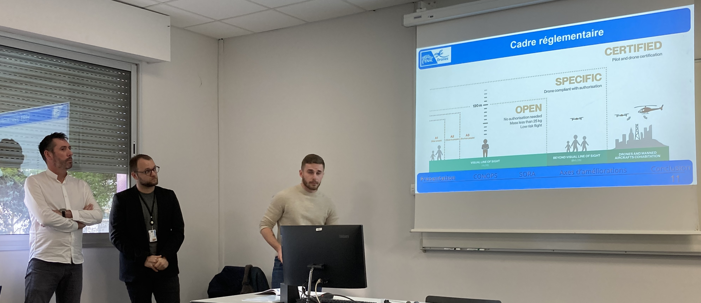
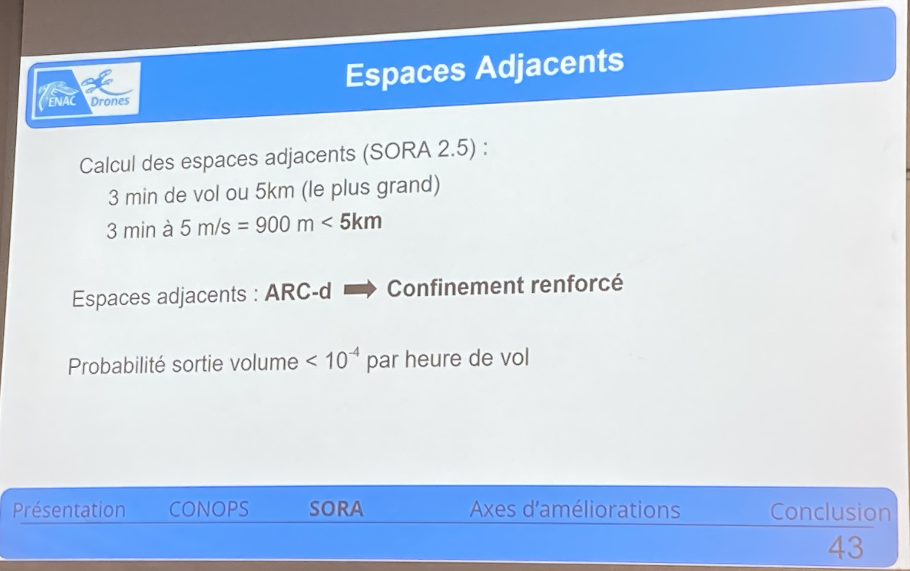

Aerial Drone Show study at ENAC, presented by L'ELCHAT Yannik, LAVIELLE Diégo, and PETIT Mathieu.

<!--more-->

Aerial drone shows became more widespread so this team of ENAC students studied the use cases and their regulatory framework. Not only had they analyzed the regulation but they also had a look at how it articulates with the machines and the concept of operations to make the operations safer. They had rich and very interesting interviews with UAS manufacturer ([Drotek](https://store-drotek.com/)), Aerial Drone Show operators ([Allumee](https://www.allumee.com/) and [Dronisos](https://fr.dronisos.com/)), and tutorship from [DGAC](https://www.ecologie.gouv.fr/direction-generale-laviation-civile-dgac).

They found 6 axes of improvement regarding the process of preparing this specific activity. Some are already ongoing, at least for France:
- generic approval, based on the operational parameters of the mission. Then, make a case-by-case mission sheet corresponding to the approved OP to accelerate the authorization request.
- another drone class, for the swarms to have some basic requirements fulfilled by the UAS itself
- tools for mission preparation and authorization requests (Clearance, DroneKeeper) but available as a public service
- Predefined Risk Assessment (PDRA) for swarms
- more transparent and increased cooperation with prefectures regarding swarm operations
- preparation for SORA 2.5

---

    

---

Here are the details for each of these axes of improvement.

### Generic file, mission sheet
A clear point of improvement used today by some companies is the drafting of a generic SORA and CONOPS, valid for several missions. The operator then seeks to describe the more general characteristics of the operation and the area, so that they can be used in as many cases as possible. Once validated, these documents can be reused for various operations, provided they are accompanied by a mission sheet describing the event in greater detail. Drawing up a SORA can sometimes be a long and tedious process, so much so that many companies call in professionals who specialize in drafting such documents. The advantage of not having to draw up a new SORA for each operation is obvious.

### Certified drone or at least another Class
Obtaining drone certification is becoming an inescapable necessity for operators to ensure the safety and reliability of flight operations. This certification guarantees that drones meet rigorous design, manufacturing, and performance standards, enabling operators to carry out their activities safely and in compliance with current regulations. By obtaining certification for their drones, operators can benefit from greater assurance of the quality and safety of their aerial fleet, helping to boost the confidence of customers and regulatory authorities alike. What's more, drone certification can also facilitate access to certain restricted or sensitive areas, where only certified aircraft are allowed to fly. In short, drone certification represents an essential element in promoting the professionalization and sustainable development of the drone sector, by guaranteeing high standards of safety and quality for all flight operations.

### Use of public services
We believe it is important to pay particular attention to the use of private services such as Drone Keeper or Clearance to obtain the authorizations required for drone operations. Although these platforms offer convenient and rapid solutions for operators, their exclusive use raises concerns about transparency, data security, and fair access to authorizations. Moreover, sensitive data supplied to these platforms may be exposed to security and confidentiality risks, underlining the need for strict regulation and appropriate safeguards to protect user information. With this in mind, it seems appropriate to promote and support the development of public authorization services that guarantee transparency, data security, and equal access for all drone operators. By encouraging the implementation of public solutions, authorities can ensure a fair and balanced regulatory framework, promoting a safe and equitable operating environment for the entire drone industry.

### PDRA for drone swarms
To promote effective evolution in the swarm drone sector, it is essential that change is not limited to operators, but also extends to regulation itself. Taking this a step further, the introduction of new PDRAs that take specific account of swarm drone operations could represent a significant time-saver for operators. This approach would avoid the tedious need to draft a new SORA for each operation, by offering official "generic" SORAs that cover a range of operational scenarios. By adopting such an approach, civil aviation authorities could facilitate and speed up the authorization process while ensuring an adequate level of safety and compliance with regulatory standards.

### Questions surrounding prefectural authorization
A major challenge lies in the often lengthy delays operators face when waiting for answers from local authorities such as prefectures. Indeed, administrative procedures can be complex and sometimes slow, leading to significant delays in the organization of drone operations, particularly for air shows and other events. To alleviate this problem, we need to harmonize processes and improve communication between drone operators and local authorities. Prefectures and other competent bodies must develop more efficient mechanisms for processing requests for flight authorization while ensuring compliance with safety and regulatory standards. Not only such harmonization would facilitate the planning and execution of drone operations but it would also help to strengthen trust and collaboration between all the players involved in this fast-growing field.

---

    

---

### Preparing for change with SORA 2.5
The introduction of SORA 2.5 also promises several new features. One of the major changes introduced by EASA concerns GRC, which is moving from a predominantly qualitative approach to a much more quantitative one. This transition reflects the growing recognition of the importance of quantitative data in risk assessment and decision-making. By adopting this approach, EASA seeks to better understand and anticipate potential risks, while developing more targeted and effective mitigation strategies. This change is underpinned by the introduction of new population density maps, which take into account not only the distribution of the population throughout the year but also during the day - for example, a residential area will be more densely populated at night than during the day. This approach provides a better understanding of population dynamics, enabling safety measures to be adapted accordingly.
At the same time, EASA has also redefined the notion of adjacent space in its regulations, establishing specific criteria for defining laterally and vertically adjacent areas. 
Finally, the sequence of steps 8 and 9 has been adjusted, with the determination of the containment required for the operation now being made before the Operational Safety Objectives (OSO) are drafted. 

 

<!--<iframe width="560" height="315" src="https://www.youtube.com/embed/0MGmwDh7u-I?si=ntc88idkoh9hKQH4" title="YouTube video player" frameborder="0" allow="accelerometer; autoplay; clipboard-write; encrypted-media; gyroscope; picture-in-picture; web-share" allowfullscreen></iframe>-->
